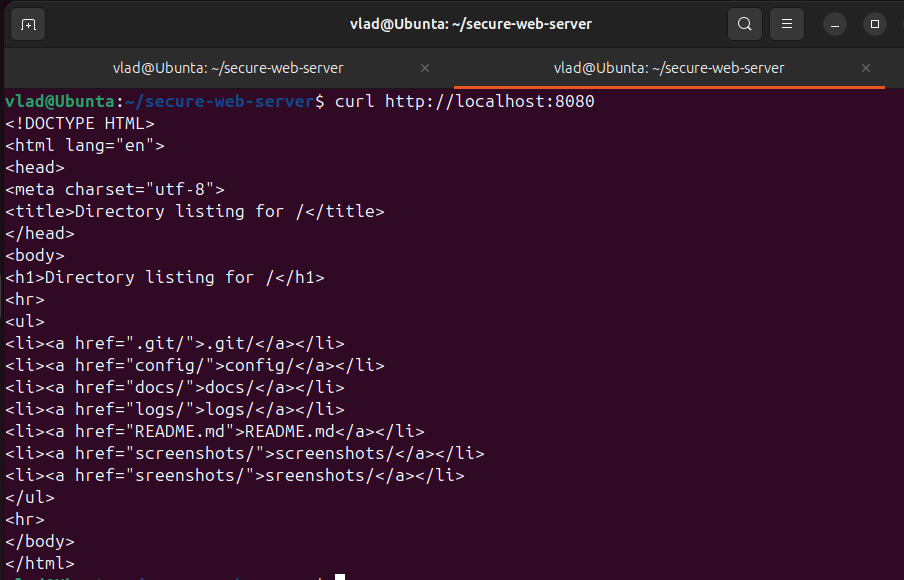
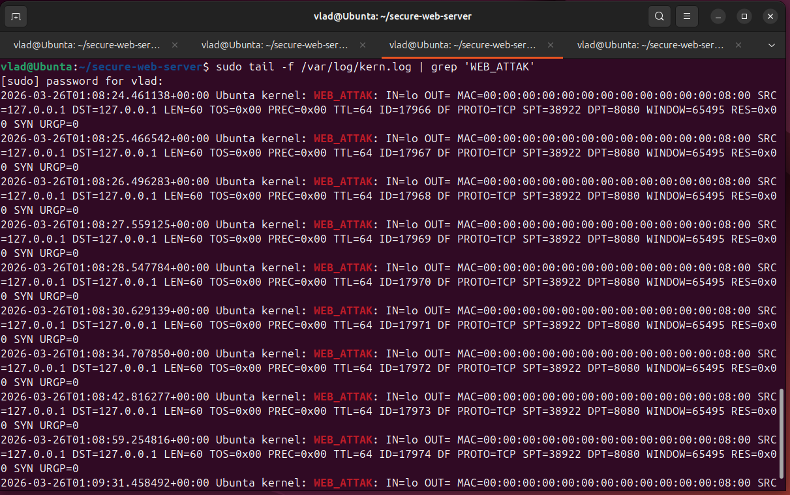
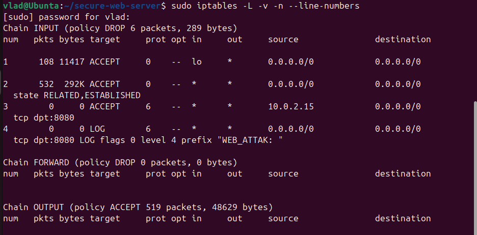
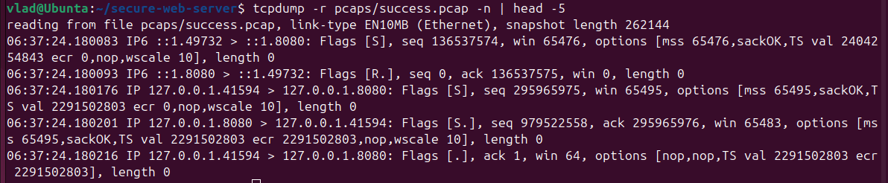
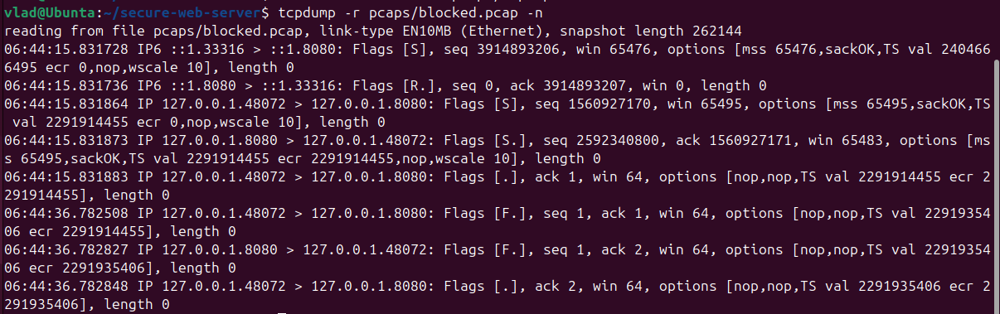
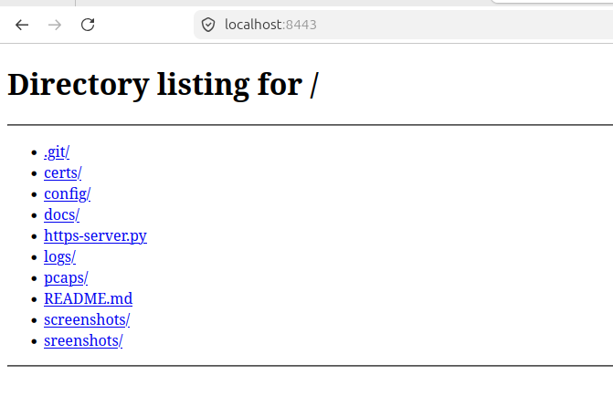
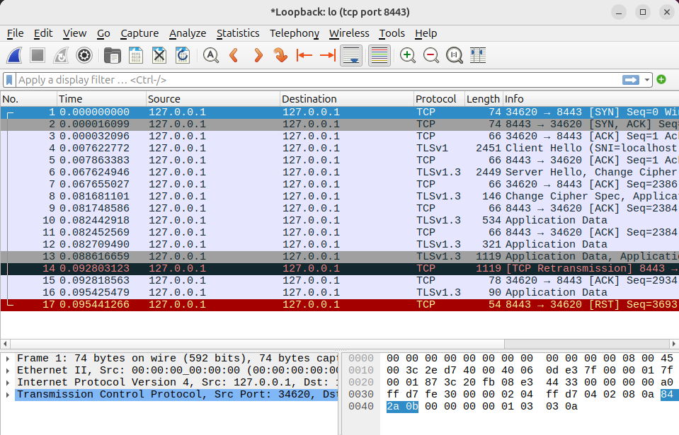

# 🔒 Защищённый веб-сервер

[](https://github.com/ibVLAD24/secure-web-server/stargazers)
[](LICENSE)
[](https://ubuntu.com/)

## 📌 О проекте

Этот проект демонстрирует настройку **защищённого веб-сервера** с использованием **iptables** для ограничения доступа по IP-адресу.  
Сервер доступен **только с одного разрешённого IP**, все остальные попытки подключения логируются.

### 🎯 Что делает проект:
- ✅ Веб-сервер на Python (порт 8080)
- ✅ Политика **DROP** по умолчанию (всё запрещено)
- ✅ Разрешён доступ только с IP `10.0.2.15`
- ✅ Логирование всех попыток подключения на порт 8080

---

## 🛠️ Технологии

| Технология | Назначение |
|------------|------------|
| **Ubuntu 22.04** | Операционная система |
| **Python 3** | Встроенный HTTP-сервер |
| **iptables** | Файервол, фильтрация трафика |
| **Git** | Контроль версий |
| **Docker** | Контейнеризация приложения |

---

## 🚀 Быстрый старт

### 1️⃣ Запуск веб-сервера
```bash
python3 -m http.server 8080
```

### 2️⃣ Применение правил iptables
```bash
sudo bash config/iptables-rules.sh
```

### 3️⃣ Проверка доступа с разрешённого IP
```bash
curl http://localhost:8080
```
✅ Должен показаться HTML-код

### 4️⃣ Имитация атаки
```bash
telnet localhost 8080
```
❌ В логах появится запись:
```
WEB_ATTAK: ... SRC=127.0.0.1 ... DPT=8080 ...
```

---

## 📸 Демонстрация

| Успешный доступ | Логирование атаки | Правила iptables |
|-----------------|-------------------|------------------|
|  |  |  |


---

## 📂 Структура проекта

```
secure-web-server/
├── Dockerfile                  # Инструкция для сборки контейнера
├── https-server.py             # HTTPS-сервер на Python
├── certs/
│   ├── server.crt              # Самоподписанный сертификат
│   └── server.key              # Приватный ключ
├── screenshots/                # Скриншоты работы
└── README.md                   # Документация
```

---

## 🔐 Как это работает

### Правила iptables

| Правило | Описание |
|---------|----------|
| `:INPUT DROP` | Всё, что не разрешено — запрещено |
| `-A INPUT -i lo -j ACCEPT` | Разрешить локальные соединения |
| `-A INPUT -m state --state RELATED,ESTABLISHED -j ACCEPT` | Разрешить уже установленные соединения |
| `-A INPUT -s 10.0.2.15/32 -p tcp --dport 8080 -j ACCEPT` | Разрешить доступ с твоего IP |
| `-A INPUT -p tcp --dport 8080 -j LOG` | Логировать все попытки на порт 8080 |

### Схема прохождения пакета

```
[Интернет] → [Твой компьютер]
                ↓
         [iptables INPUT]
                ↓
    ┌─────────────────────────────────┐
    │ 1. Пакет от 10.0.2.15:8080?    │ → ✅ РАЗРЕШИТЬ
    │ 2. Пакет от любого на 8080?     │ → 📝 ЗАЛОГИРОВАТЬ
    │ 3. Любой другой пакет?          │ → ❌ ЗАБЛОКИРОВАТЬ
    └─────────────────────────────────┘
```

---

## 📝 Логи атак

Все попытки подключения с неразрешённых IP попадают в `/var/log/kern.log`:

```
WEB_ATTAK: IN=lo OUT= ... SRC=1.2.3.4 DST=127.0.0.1 ... DPT=8080 ...
```
## 📡 Анализ трафика (Wireshark)

В папке `pcaps/` находятся дампы трафика.  
Их нужно **скачать** и открыть в Wireshark:

1. Нажми на файл → **Download**
2. Открой в Wireshark: `wireshark success.pcap`

| Файл | Что показывает |
|------|----------------|
| `success.pcap` | Успешное подключение `curl`: TCP-рукопожатие (SYN, SYN-ACK, ACK), HTTP GET, HTTP 200 |
| `blocked.pcap` | Заблокированная попытка `telnet`: только SYN (дальше iptables отбросил) |

**Фильтр в Wireshark для просмотра только HTTP:** 


### Скриншоты

| Успешный трафик | Заблокированный трафик |
|-----------------|------------------------|
|  |  |
---

## 🔒 HTTPS-версия

| HTTPS сервер | Wireshark (TLS) |
|--------------|-----------------|
|  |  |

### Вывод
- В Wireshark видны только TLS-пакеты (шифрование)
- Данные (GET, POST, HTML) не читаются
---
## 🐳 Запуск в Docker

### Сборка образа
```bash
docker build -t my-https-server .
```

### Запуск контейнера
```bash
docker run -d -p 8443:8443 --name my-server my-https-server
```

### Проверка
Открой браузер: `https://localhost:8443`

### Остановка и удаление
```bash
docker stop my-server
docker rm my-server
```

---

### Полезные ссылки
- [Документация iptables](https://netfilter.org/documentation/)
- [GitHub проекта](https://github.com/ibVLAD24/secure-web-server)

---

## 👨‍💻 Автор

**ibVLAD24** — студент направления 10.05.03 "Информационная безопасность"

[](https://github.com/ibVLAD24)

---

## 📄 Лицензия

Этот проект распространяется под лицензией MIT.

